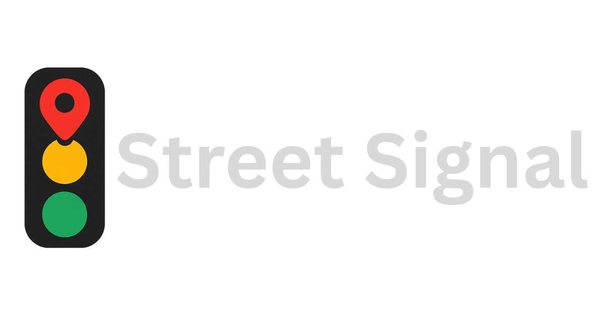

<div align="center">
  
</div>

# StreetSignal Platform

## What is StreetSignal Platform?

StreetSignal is a fork of Ushahidi Platform and is an open source web application for information collection, visualization and interactive mapping. It helps you to collect info from: SMS, Twitter, RSS feeds, Email, and **Telegram**. It helps you to process that information, categorize it, geo-locate it and publish it on a map. We have updated it to be more useful for reporting activity and crowd sourced oversight.

This repository contains the backend code with the REST API implementation.

Head over to the [Platform Client repository](https://github.com/Citizenry/streetsignal-platform-clients) for the browser app code.

## 🚀 Quickstart (Full Stack with Docker)

This guide will help you get the complete StreetSignal application stack running locally, including both the backend API and frontend client.

### Prerequisites

- [Docker](https://docs.docker.com/get-docker/) and [Docker Compose](https://docs.docker.com/compose/install/)
- [Make](https://www.gnu.org/software/make/) command (for build automation)
- [Git](https://git-scm.com/) (to clone the frontend repository)

### 1. Clone Required Repositories

You'll need both the platform (backend) and client (frontend) repositories:

```bash
# Clone the platform repository (if you haven't already)
git clone https://github.com/StreetSignal/streetsignal-platform.git
cd platform

# Clone the client repository to the expected location
git clone https://github.com/Citizenry/streetsignal-platform-clients.git /path/to/your/repos/platform-client-mzima
```

### 2. Start the Full Stack

From the platform directory, run:

```bash
make start
```

This command will:
- Build all Docker containers
- Set up the database with migrations and seed data
- Start the backend API server
- Build and start the frontend client
- Configure all necessary services (MySQL, Redis, etc.)

### 3. Access the Application

Once all services are running:

- **Frontend (Web Client)**: http://localhost:3000
- **Backend API**: http://localhost:8081
- **Database**: MySQL on port 33061

### 4. Default Credentials

The system will be seeded with default data. Check the database seeder files for default user credentials.

### Other Useful Commands

```bash
# View logs from all services
make logs

# Stop all services
make stop

# Restart services (with rebuild)
make start

# Apply changes without full rebuild
make apply

# Enter the platform container for debugging
make enter

# Completely tear down (including database)
make down
```

## Requirements

- **PHP**: 7.4 - 8.3 (PHP 8.2+ recommended)
- **Laravel**: 9.x
- **Database**: MySQL 5.7+ or PostgreSQL 9.6+
- **Docker**: For containerized development
- **Make**: For build automation

## Setup essentials

The shortest path to get up and running is:

- Install Docker Engine
- Install Make command (parses Makefile)
- Run `make start`

The backend will be listening on localhost:8081.

> **What about the browser client application?**

> Once your Platform backend is running, head over to the [platform-client-mzima](https://github.com/Citizenry/streetsignal-platform-clients) repository to get the in-browser Platform experience!

### Other helpful commands

You may use `make start` to restart the containers (does a full container build).

You may use `make apply` to apply dependency and migration changes to containers (without full container build). **Note:** this requires containers to be up.

To stop Docker containers run `make stop`

To take everything down (including deleting the database) `make down` will do that for you.

## Recent Updates

### PHP 8.2+ Compatibility
- Updated to support PHP 8.2 and 8.3
- Fixed compatibility issues with modern PHP versions
- Updated dependencies for better performance and security

### Telegram Bot Integration
- **NEW**: Full Telegram bot integration for report submission
- Supports both anonymous and authenticated submissions
- Multi-step form flows with media upload support
- OAuth-based account linking
- Rate limiting and spam protection

### Laravel 9 Upgrade
- Upgraded to Laravel 9.x for improved performance
- Enhanced security features
- Better dependency management

## Data Sources

StreetSignal Platform supports multiple data collection methods:

- **Web Interface**: Browser-based report submission
- **SMS**: Text message integration via multiple providers
- **Email**: Email-to-report conversion
- **Twitter**: Social media monitoring and collection
- **RSS Feeds**: Automated content aggregation
- **Telegram Bot**: Interactive chat-based reporting *(NEW)*
- **API**: Direct programmatic access

## Development

### Testing
```bash
# Run all tests
composer test

# Run unit tests only
composer unit

# Run with coverage
composer test-dev
```

### Code Quality
```bash
# Lint code
composer lint

# Fix linting issues
composer fixlint
```

### Database
```bash
# Run migrations
composer migrate

# Generate Passport keys
composer bootstrap:passport
```

## Manuals and documentation

### A note for grassroots organizations
If you are starting a deployment for a grassroots organization, you can apply for a free social-impact responder account [here](https://www.StreetSignal.com/pricing/apply-for-free) after verifying that you meet the criteria.

### Platform User Manual

The official reference on how to use the Platform. Create surveys, configure data sources... it's all in there!
[Platform User Manual](https://docs.StreetSignal.com/platform-user-manual/)

### Platform Developer Documentation

Key pointers on installing and developing on the Platform.

[Platform Developer Documentation](https://docs.StreetSignal.com/platform-developer-documentation/)

## API Documentation

- **API v3**: Legacy API (maintenance mode)
- **API v5**: Current API with full feature support
- **Telegram Bot API**: New integration endpoints

## Security

- Regular security updates and dependency management
- OAuth 2.0 authentication via Laravel Passport
- Rate limiting and abuse protection
- Input validation and sanitization
- Secure file upload handling

## Contributing

We welcome contributions! Please see our [Contributing Guide](CONTRIBUTING.md) for details on:

- Code standards and guidelines
- Development workflow
- Testing requirements
- Security considerations

## Credits

## Contributors ✨

Thanks goes to the wonderful people who [[Contribute](CONTRIBUTING.md)]! See the list of contributors at [all-contributors](docs/contributors-to-StreetSignal.md)

This project follows the [all-contributors](https://github.com/all-contributors/all-contributors) specification. Contributions of any kind welcome!

## License

StreetSignal Platform is licensed under the [AGPL-3.0](LICENSE-AGPL) license.

[client]: https://github.com/StreetSignal/platform-client-mzima
